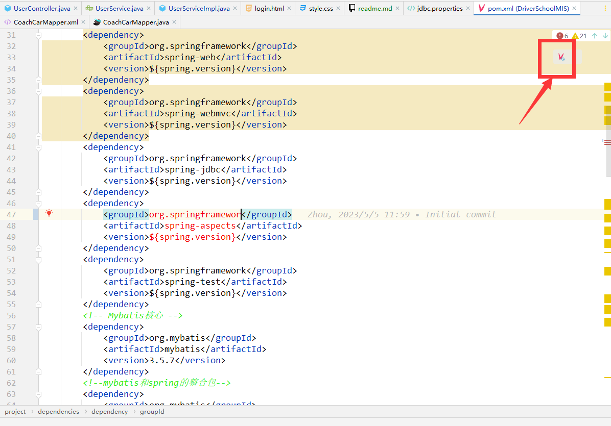
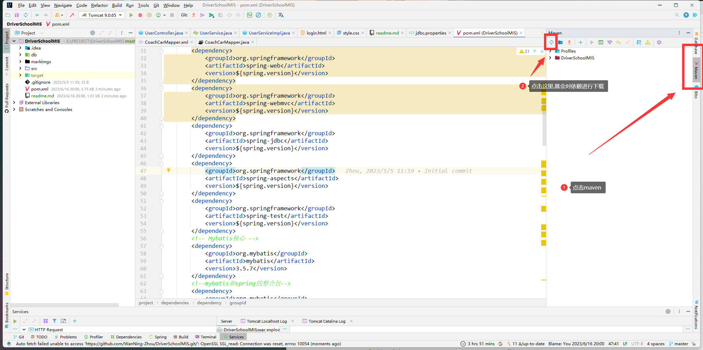
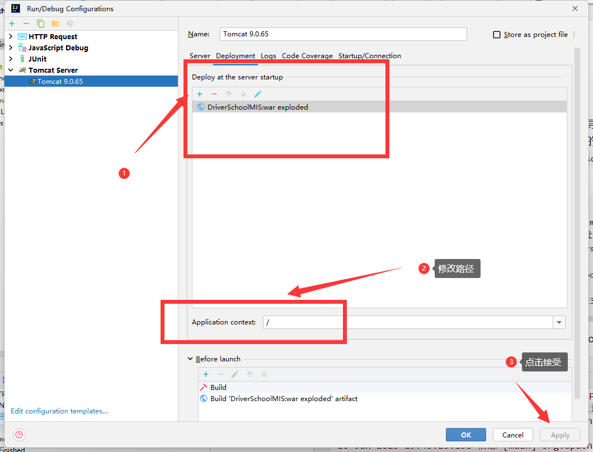
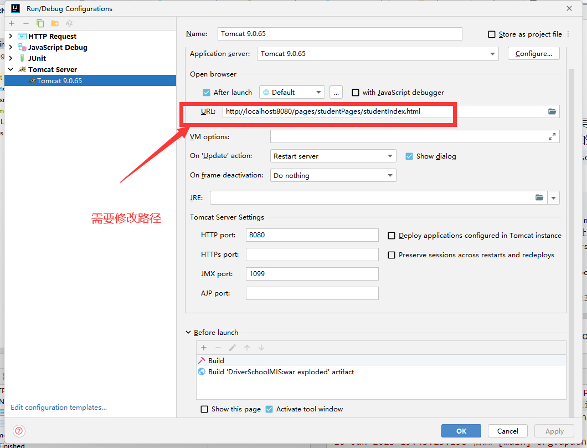
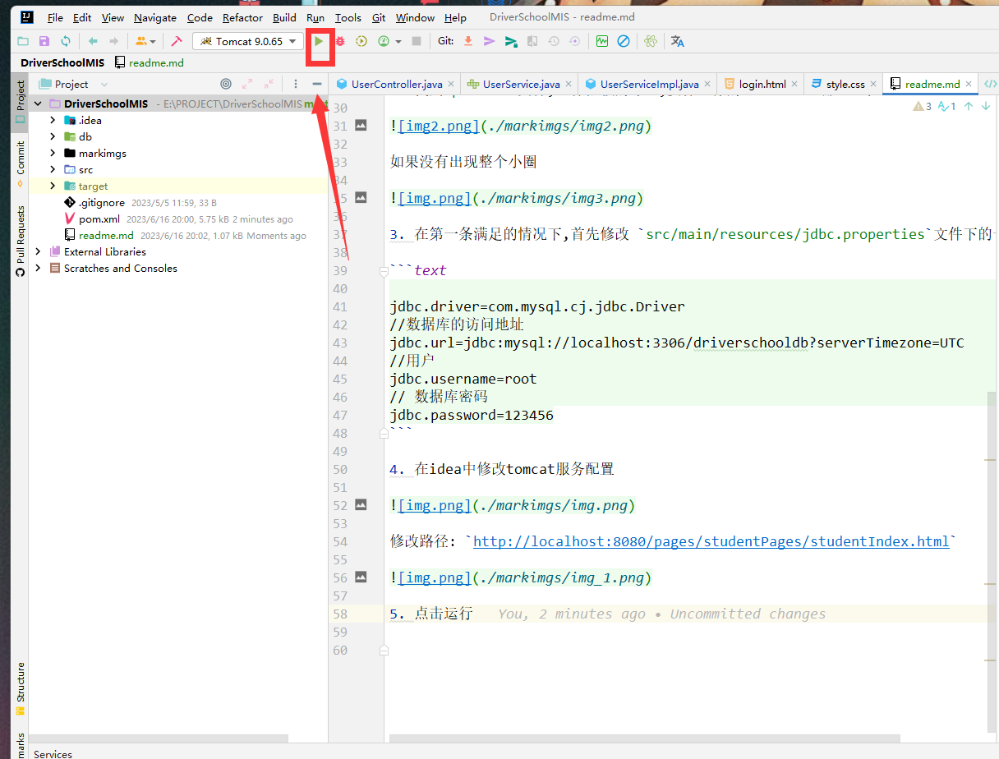
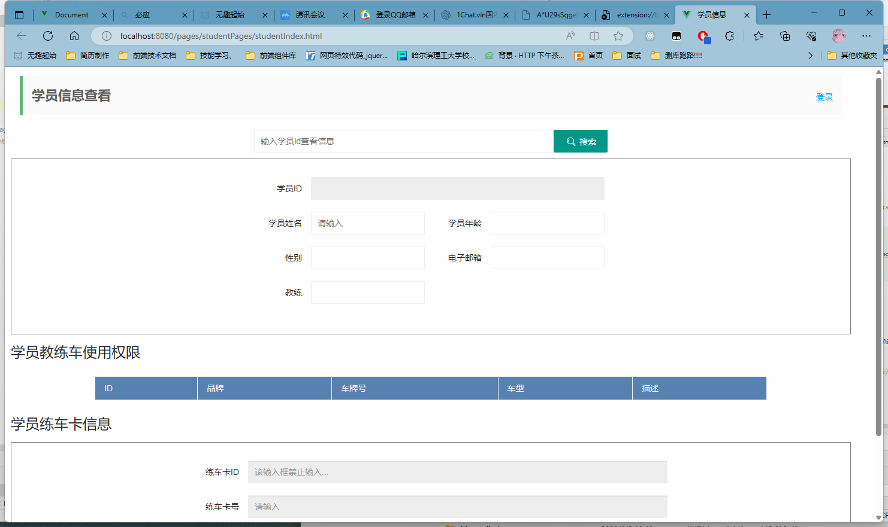
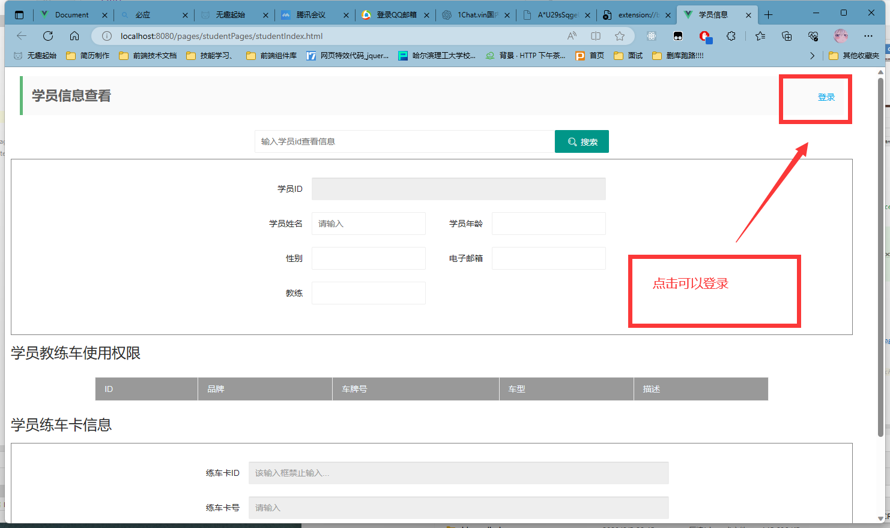
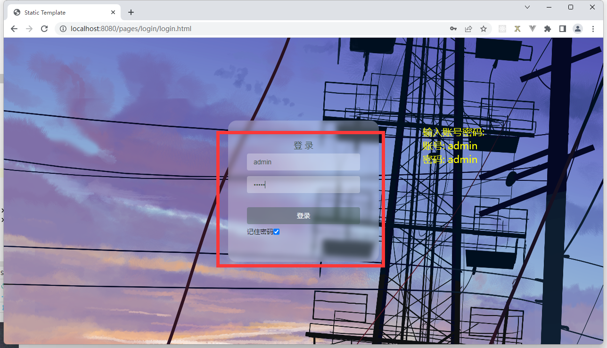
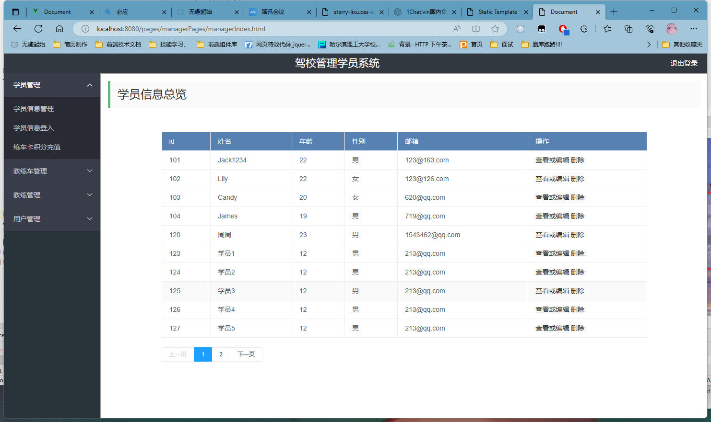

# 驾校学员管理系统

## 数据库

- 数据库环境: mysql 8.0.31


项目所需数据库在db文件夹下, 

在sqlyog或者其他mysql图形化操作工具中导入即可


## 运行环境

- tomcat: 9.0.65
- jdk: 12
- maven:3.8.6

## 开发环境

- idea: 2023.3.1


## 部署


1. 请保证数据库导入成功;以及运行环境正常 
2. 找到`pom.xml`文件,进行依赖的导入,要保证你的idea已经正确配置了maven



如果没有出现整个小圈



3. 在第一条满足的情况下,首先修改 `src/main/resources/jdbc.properties`文件下的一些配置

```text

jdbc.driver=com.mysql.cj.jdbc.Driver
//数据库的访问地址
jdbc.url=jdbc:mysql://localhost:3306/driverschooldb?serverTimezone=UTC
//用户
jdbc.username=root
// 数据库密码
jdbc.password=123456
```

4. 在idea中修改tomcat服务配置



修改路径: `http://localhost:8080/pages/studentPages/studentIndex.html`



5. 点击运行



6. 出现以下界面






**登录**:

```text
管理员
账号:admin
密码: admin

教练员:

账号: admin
密码: admin

```



**登录成功显示以下页面**




